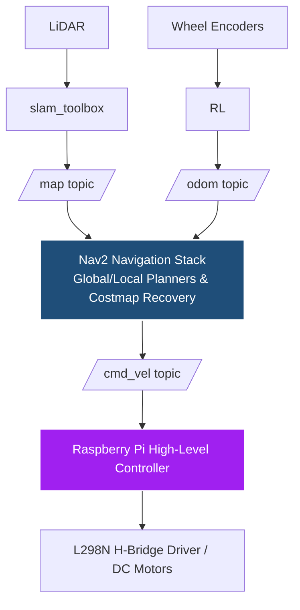

# Autonomous Mobile Robot using ROS 2 and Nav2

A differential-drive autonomous mobile robot framework designed and implemented using ROS 2 and the Nav2 navigation stack. This repository contains the system architecture, navigation configurations, and launch files for indoor mapping, localization, and autonomous navigation.

> **Hardware Note:** The physical robot hardware is currently deployed at the University of Aleppo, Syria. This repository serves as the central host for the production-ready navigation software, system node architectures, and parameter configurations. Hardware execution video clips will be uploaded following the next scheduled site deployment.

---

## 🚀 Key Features
* **Framework:** ROS 2 (Jazzy/Humble)
* **Autonomous Navigation:** Nav2 Stack utilizes AMCL for localization and Navfn/DWAPlanner for global/local path planning.
* **Mapping & SLAM:** Built environment maps using LiDAR and `slam_toolbox`.

## 🛠️ System Architecture

## 📁 Repository Structure
* `my_robot_params.yaml`: Contains tuned costmap parameters, AMCL configuration, and planner settings for the Nav2 stack.
* `slam.launch.py`: Houses the master launch files integrating the robot description, localization, and navigation nodes.
* `robot.urdf.xacro`: Robot simulation and hardware description files (differential drive chassis configuration).

## 🔧 Future Milestone Deployments
- [ ] Upload Rviz simulation screen captures of autonomous path execution.
- [ ] Integrate behavior trees for custom warehouse recovery behaviors.
- [ ] Add hardware telemetry tracking via a local web interface.
- [ ] Add sensor fusion between MPU6050 and wheel encoders for better robot localization.
